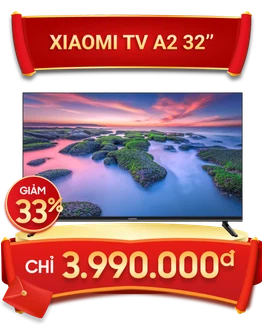
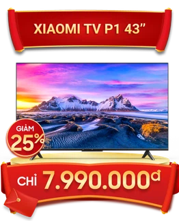
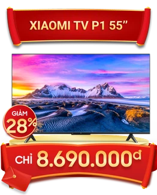
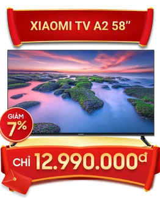
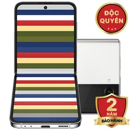
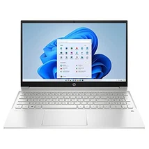
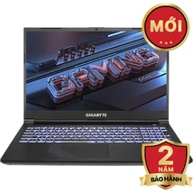
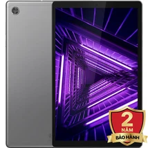

# vankhanh33380
<!DOCTYPE html>
<html lang="en">
<head>
    <meta charset="UTF-8">
    <meta http-equiv="X-UA-Compatible" content="IE=edge">
    <meta name="viewport" content="width=device-width, initial-scale=1.0">
    <title>TRang chính</title>
    <link rel="stylesheet" href="1.css">
    <link rel="stylesheet" href="https://cdnjs.cloudflare.com/ajax/libs/font-awesome/6.2.1/css/all.min.css" integrity="sha512-MV7K8+y+gLIBoVD59lQIYicR65iaqukzvf/nwasF0nqhPay5w/9lJmVM2hMDcnK1OnMGCdVK+iQrJ7lzPJQd1w==" crossorigin="anonymous" referrerpolicy="no-referrer" />
    
</head>
<body>
    <header>
        

                    <ul>
                        <li style="float: left;"></li>
                        <li>
                            <a href="#">
                                <input type="search">
                                <button id="search-text"><i class="fas fa-magnifying-glass"></i></i></button>
                            </a>
                        </li>
                        <li>
                            <a href="assignmentcon.html">
                                <i class="fas fa-thin fa-file-lines"></i>
                                Thông tin hay
                            </a>
                        </li>
                        <li>
                            <a href="#">
                                <i class="fas fa-thin fa-file-invoice-dollar"></i>
                                Thanh toán & tiện ích
                            </a>
                        </li>
                        <li>
                            <a href="#">
                                <i class="fas fa-thin fa-circle-user"></i>
                                Tài khoản của tôi
                            </a>
                        </li>
                        <li>
                            <a href="#">
                                <i class="fas fa-thin fa-cart-shopping"></i>
                                Giỏ hàng
                            </a>
                        </li>
                    </ul>
        

    </header>
    <nav class="menu">
        <ul>
            <li>
                <a href="#">
                    <i class="fas fa-solid fa-mobile"></i>
                    <h7 style="padding-right: 40px;">Điện thoại</h7>
                </a>
            </li>
            <li>
                <a href="#">
                    <i class="fas fa-thin fa-laptop"></i>
                    <h7 style="padding-right: 35px;">laptop</h7>
                </a>
            </li>
            <li>
                <a href="#">
                    <i class="fas fa-regular fa-tablet"></i>
                    <h7 style="padding-right: 40px;">máy tính bảng</h7>
                </a>
            </li>
            <li>
                <a href="#">
                    <i class="fas fa-brands fa-apple"></i>
                    <h7 style="padding-right: 35px;">Apple</h7>
                </a>
            </li>
            <li>
                <a href="#">
                    <i class="fas fa-sharp fa-solid fa-computer"></i>
                    <h7 style="padding-right: 35px;">PC-Linh kiện</h7>
                    <ul>
                        <li style="width: 100%;"><a href="#">PC</a></li>
                        <li style="width: 100%;"><a href="#">Linh kiện</a></li>
                        <li style="width: 100%;"><a href="#">Màn hình</a></li>
                        <li style="width: 100%;"><a href="#">Xây dựng PC</a></li>
                    </ul>
                </a>
            </li>
            <li>
                <a href="#">
                    <i class="fas fa-solid fa-headphones-simple"></i>
                    <h7 style="padding-right: 35px;">Tai nghe</h7>
                </a>
            </li>
            <li>
                <a href="#">
                    <i class="fas fa-solid fa-rotate-right"></i>
                    <h7 style="padding-right: 37px;">Máy củ giá rẻ</h7>
                </a>
            </li>
            <li>
                <a href="#">
                    <i class="fas fa-solid fa-house"></i>
                    <h7 style="padding-right: 34px;">Hàng gia dụng</h7>
                </a>
            </li>
            <li>
                <a href="#">
                    <i class="fas fa-thin fa-sim-card"></i>
                    <h7 style="padding-right: 34px;">Sim & Thẻ</h7>
                </a>
            </li>
            <li>
                <a href="assignmentcon1.html">
                    <i class="fas fa-duotone fa-percent"></i>
                    <h7>Khuyến mãi</h7>
                </a>
            </li>
        </ul>
    </nav>
    <article>
        

            

           

            

                    
                    
ĐIỆN THOẠI

            

            

                    
                    
LAPTOP

            

            

                    
                    
PC- LẮP RÁP

            

            

                    
                    
MÁY TÍNH BẢNG

            

            

                    
                    
THIẾT BỊ THÔNG MINH

            

            

                    
                    
GIA DỤNG

            

            

                

                
APPLE

            

            

                

                    
                    
SAMSUNG

                

            

            

                

                    
                    
ĐỒNG HỒ THÔNG MINH

                

            

            

                

                    
                    
PHỤ KIỆN

                

            

            

                

                    
                    
MÀNG HÌNH

                

            

            

                

                    
                    
MÁY CŨ

                

            

        

        

        <h2 align="left" class="chu" style="margin-bottom: -100px;margin-top: 300px;margin-left: 50px;">Sắm TV chọn ngay XIAOMI</h2>
            

                

                

                    
                    
                    
                    
                

            

        

            
        

        

            

                    <h2 align="left" class="chu">Điện thoại nổi bật</h2>
                    

                        <a href="assignmentcon2.html" style="text-decoration: none;">
                            

                        
IPhone 13 128GB

                        </a>
                        
18.490.000đ

                        

                            <del>
                                19.990.000đ
                            </del>
                        

                        

                            CPU: Apple A15 Bionic  
                            Màn hình: 6.1inch  
                            RAM: 4GB  
                            Bộ nhớ trong: 128GB
                        

                    

                    

                        <a href="#" style="text-decoration: none;">
                            
 

                            
Xiaomi Redmi Note 11 4GB - 128GB

                        </a>
                        
4.190.000đ

                        

                            <del>
                                4.990.000đ
                            </del>
                        

                        

                            CPU: Snapdragon 680  
                            Màn hình: 6.43inch  
                            RAM: 4GB  
                            Bộ nhớ trong: 128GB
                        

                    

                    

                        <a href="#" style="text-decoration: none;">
                            
 

                            
Samsung Galaxy S22 Ultra 5G 128Gb

                        </a>
                        
30.990.000đ

                        

                            <del>
                                21.990.000đ
                            </del>
                        

                        

                            CPU: Snapdragon 8 Gen 1  
                            Màn hình: 6.8inch  
                            RAM: 8GB  
                            Bộ nhớ trong: 128GB
                        

                    

                    

                        <a href="#" style="text-decoration: none;">
                            

                            
Xiaomi redmi 10 128GB 2021

                        </a>
                        
4.290.000đ

                        

                            <del>
                                3.690.000đ
                            </del>
                        

                        

                            CPU: Media Tek Helio G88 
                            Màn hình: 6.5inch  
                            RAM: 4GB  
                            Bộ nhớ trong: 128GB
                        

                    

                    

                        <a href="#" style="text-decoration: none;">
                            

                            
Iphone 11 64Gb

                        </a>
                        
10.999.000đ

                        

                            <del>
                                14.999.000đ
                            </del>
                        

                        

                            CPU: Apple A13 Bionic  
                            Màn hình: 6.1inch  
                            RAM: 4GB  
                            Bộ nhớ trong: 64GB
                        

                    

                    

                        <a href="#" style="text-decoration: none;">
                            

                            
Samsung Galaxy Z Flip4 Bespoke Edition

                        </a>
                        
17.490.000đ

                        

                            <del>
                                26.990.000đ
                            </del>
                        

                        

                            CPU: Snapdragon 8+ Gen 1  
                            Màn hình chính: 6.7inch/Màn hình phụ: 1.9inch  
                            RAM: 8GB  
                            Bộ nhớ trong: 256GB
                        

                    

                    

                        <a href="#" style="text-decoration: none;">
                            

                            
OPPO A77s 8GB - 128GB

                        </a>
                        
6.190.000dd

                        

                            <del>
                                6.290.000đ
                            </del>
                        

                        

                            CPU: Snapdragon 680  
                            Màn hình chính: 6.56inch  
                            RAM: 8GB  
                            Bộ nhớ trong: 128GB
                        

                    

                    

                        <a href="#" style="text-decoration: none;">
                            

                            
OPPO A17k 3GB - 64Gb

                        </a>
                        
3.090.000đ

                        

                            <del>
                                3.290.000đ
                            </del>
                        

                        

                            CPU: Helio G35  
                            Màn hình: 6.56inch  
                            RAM: 3GB  
                            Bộ nhớ trong: 64GB
                        

                    

            

        

        

        

            

                    <h2 align="left" class="chu">Laptop bán chạy</h2>
                    

                        

                        
MacBook Air 13" 2020 M1 256GB

                        
21.999.000đ

                        

                            <del>
                                26.999.000đ
                            </del>
                        

                        

                            Màn hình: 13.3inch  
                            CPU: M1  
                            Ram: 8GB  
                            Ổ cứng: 256GB  
                            Đồ họa: Apple M1  
                            Trọng lượng: 1.29kg
                        

                    

                    

                        

                        
Asus Tuf Gaming FX506LHB - HN188W i5 10300H

                        
15.890.000đ

                        

                            <del>
                                20.990.000đ
                            </del>
                        

                        

                            Màn hình: 15.6inch  
                            CPU: Core i5  
                            Ram: 8GB (1 thanh 8GB) 
                            Ổ cứng: 512GB  
                            Đồ họa: NVIDIA GeForce GTX 1650 4GB 
                            Trọng lượng: 2.3kg
                        

                    

                    

                        

                        
HP Pavilion 15-eg2057TU i5 1240P/6k787PA

                        
17.090.000đ

                        

                            <del>
                                18.990.000đ
                            </del>
                        

                        

                            Màn hình: 15.6inch  
                            CPU: Core i5  
                            Ram: 8GB (2 thanh 4GB) 
                            Ổ cứng: 512GB  
                            Đồ họa: ntel Iris Xe Graphics 
                            Trọng lượng: 1.702kg
                        

                    
 
                    

                        

                        
Asus Tuf Gaming FA506HIRB - HN019W R5 4600H

                        
16.490.000đ

                        

                            <del>
                                19.990.000đ
                            </del>
                        

                        

                            Màn hình: 15.6inch  
                            CPU: Ryzen 5  
                            Ram: 8 GB (1 thanh 8 GB)  
                            Ổ cứng: 512GB  
                            Đồ họa: NVIDIA GeForce GTX 1650 4GB 
                            Trọng lượng: 2.30 kg
                        

                    

                    

                        

                        
MSI Gaming GF63 thin 11SC - 663VN i711800H

                        
18.490.000đ

                        

                            <del>
                                19.990.000đ
                            </del>
                        

                        

                            Màn hình: 15.6inch  
                            CPU: Cori i5  
                            Ram: 16 GB (2 thanh 8 GB)  
                            Ổ cứng: 512GB  
                            Đồ họa: NVIDIA GeForce RTX 3050 4GB 
                            Trọng lượng: 2.25kg
                        

                    

                    

                        

                        
MSI Gaming GF63 thin 11SC - 663VN i711800H

                        
18.490.000đ

                        

                            <del>
                                19.990.000đ
                            </del>
                        

                        

                            Màn hình: 15.6inch  
                            CPU: Cori i7  
                            Ram: 8 GB 
                            Ổ cứng: 512GB  
                            Đồ họa: NVIDIA GeForce GTX 1650 Max-Q 4GB 
                            Trọng lượng: 1.86kg
                        

                    

                    

                        

                        
MSI Gaming GF63 thin 11SC - 1090VN i5 11400H

                        
16.990.000đ

                        

                            <del>
                                18.990.000đ
                            </del>
                        

                        

                            Màn hình: 15.6inch  
                            CPU: Cori i5  
                            Ram: 8 GB (1 thanh 8 GB)  
                            Ổ cứng: 512GB  
                            Đồ họa: NVIDIA GeForce GTX 1650 4GB 
                            Trọng lượng: 1.86 kg
                        

                    

                    

                        

                        
Gigablet Gaming G5 GE i5 12500H (51VN263SH)

                        
18.990.000đ

                        

                            <del>
                                21.490.000đ
                            </del>
                        

                        

                            Màn hình: 15.6inch  
                            CPU: Cori i5  
                            Ram: 8 GB (1 thanh 8 GB)  
                            Ổ cứng: 512GB  
                            Đồ họa: NVIDIA GeForce RTX 3050 4GB 
                            Trọng lượng: 1.9 kg
                        

                    

            

        

        

            

                

                    <h2 align="left" class="chu">Tablet bán chạy</h2>
                    

                        

                        
IPad Gen 9 2021 10.2inch Wifi 64GB

                        
7.490.000đ

                        

                            <del>9.990.000đ</del>
                        

                        

                           CPU:  Apple A13 Bionic  
                           màn hình: 10.2 inch  
                           Ram: 3 GB  
                           Bộ nhớ trong: 64 GB
                        

                    

                    

                        

                        
Samsung Galaxy Tab A7 Lite

                        
3.490.000đ

                        

                            <del>4.490.000đ</del>
                        

                        

                            CPU:  MediaTek MT8768T  
                            màn hình: 8.7 inch  
                            Ram: 3 GB  
                            Bộ nhớ trong: 32 GB
                         

                    

                    

                        

                        
Lenovo Tab M10 64Gb(Gen2)

                        
4.090.000đ

                        

                            <del>5.690.000đ</del>
                        

                        

                            CPU:  MediaTek Helio P22 (MT6762R)  
                            màn hình: 10.1 inch  
                            Ram: 4 GB  
                            Bộ nhớ trong: 64 GB
                         

                    

                    

                        

                        
Masstel Tab 10 Wifi

                        
1.990.000đ

                        

                            <del>2.990.000đ</del>
                        

                        

                            màn hình: 10.1 inch  
                            Ram: 2 GB  
                            Bộ nhớ trong: 32 GB
                         

                    

                

            

            

                

                        
                        
                        
                    

                

            

    </article>
    <footer>
        

            <ul style="border: 1px solid white; float: left;margin-left: 50px;">
                <li><a href="#">Giới thiệu công ty</a></li>
                <li><a href="#">Câu hỏi thường gặp mua hàng</a></li>
                <li><a href="#">Chính sách bảo mật</a></li>
                <li><a href="#">Quy chế hoạt động</a></li>
                <li><a href="#">Kiểm tra hóa đơn điện tử</a></li>
                <li><a href="#">Tra cứu thông tin bảo hành</a></li>
            </ul>
            <ul style="border: 1px solid white; float: left;margin-left: 50px;">
                <li><a href="#">Tin tuyển dụng</a></li>
                <li><a href="#">Tin khuyến mãi</a></li>
                <li><a href="#">Hướng dẫn mua hàng onlline</a></li>
                <li><a href="#">HƯớng dẫn mua hàng trả góp</a></li>
                <li><a href="#">Chính sách trả góp</a></li>
            </ul>
            <ul style="border: 1px solid white; float: left;margin-left: 50px;">
                <li><a href="#">Hệ thống cửa hàng</a></li>
                <li><a href="#">Hệ thống bảo hành</a></li>
                <li><a href="#">Bán hàng doanh nghiệp</a></li>
                <li><a href="#">Giới thiệu máy đổi trả</a></li>
                <li><a href="#">Chính sách đổi trả</a></li>
            </ul>
            <ul style="border: 1px solid white; float: left;margin-left: 50px;">
                Tư vấn mua hàng (Miễn phí)  
                <li ><a href="#">1800 6601(Nhánh 1)</a></li>
                Hỗ trợ kỹ thuật  
                <li><a href="#">1800 6601(Nhánh 2)</a></li>
                Góp ý, khiếu nại dịch vụ (8h00-22h00)  
                <li><a href="#">1800 6616</a></li>
            </ul>
        

    </footer>
</body>
</html>
